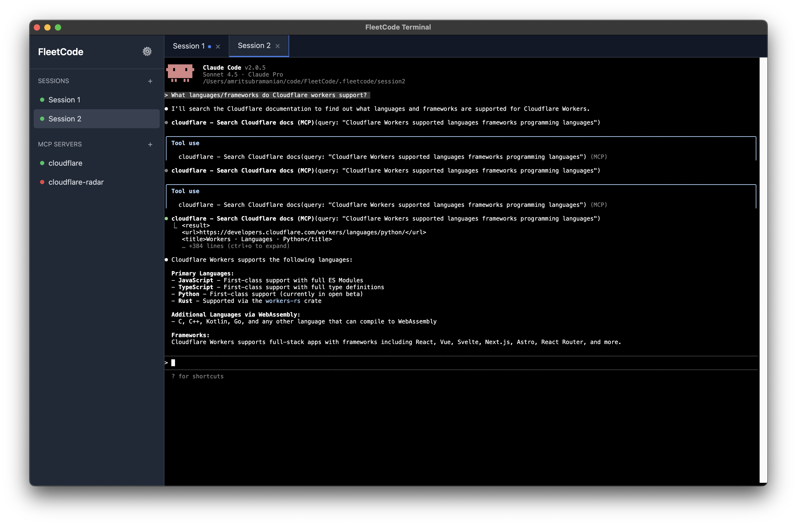

# FleetCode



A desktop terminal application for running multiple CLI coding agents simultaneously, each in isolated git worktrees.

## Features

- **Multiple Sessions**: Run multiple coding agent sessions (Claude, Codex) in parallel
- **Git Worktree Isolation**: Each session runs in its own git worktree, keeping work isolated
- **Persistent Sessions**: Sessions persist across app restarts with automatic resumption
- **Terminal Theming**: Choose from preset themes (macOS Light/Dark, Solarized Dark, Dracula, One Dark, GitHub Dark)
- **Setup Commands**: Configure shell commands to run before the coding agent starts
- **MCP Server Management**: Add and configure Model Context Protocol (MCP) servers
- **Session Management**: Rename, close, and delete sessions with automatic worktree cleanup

## Prerequisites

- Node.js 16+
- Git
- Claude CLI (`npm install -g @anthropic-ai/claude-cli`) or Codex

## Installation

```bash
npm install
```

## Usage

### Development

```bash
npm run dev
```

### Production Build

```bash
npm run build
npm start
```

## How It Works

### Session Creation

1. Select a project directory (must be a git repository)
2. Choose a parent branch for the worktree
3. Select your coding agent (Claude or Codex)
4. Optionally add setup commands (e.g., environment variables, source files)
5. FleetCode creates a new git worktree and spawns a terminal session

### Session Management

- **New Sessions**: Use `--session-id <uuid>` for first-time Claude sessions
- **Reopened Sessions**: Automatically resume with `--resume <uuid>`
- **Worktrees**: Each session gets its own isolated git worktree
- **Persistence**: Sessions are saved and can be reopened after closing the app

### Terminal Settings

Access settings via the gear icon (⚙️) in the sidebar:

- **Font Family**: Choose from common monospace fonts
- **Font Size**: Adjust terminal text size
- **Theme**: Select from preset color themes
- **Cursor Blink**: Toggle cursor blinking

### MCP Servers

Configure Model Context Protocol servers for enhanced agent capabilities:

- **stdio**: Direct process communication
- **SSE**: Server-sent events via HTTP

## Project Structure

```
FleetCode/
├── main.ts          # Main Electron process (PTY management, git operations)
├── renderer.ts      # Renderer process (UI, terminal instances)
├── index.html       # Application layout
├── styles.css       # Tailwind CSS styles
└── dist/            # Compiled output
```

## Technology Stack

- **Electron**: Desktop application framework
- **xterm.js**: Terminal emulator
- **node-pty**: PTY (pseudo-terminal) spawning
- **simple-git**: Git operations (worktree management)
- **electron-store**: Persistent configuration storage
- **Tailwind CSS**: Styling

## License

ISC
